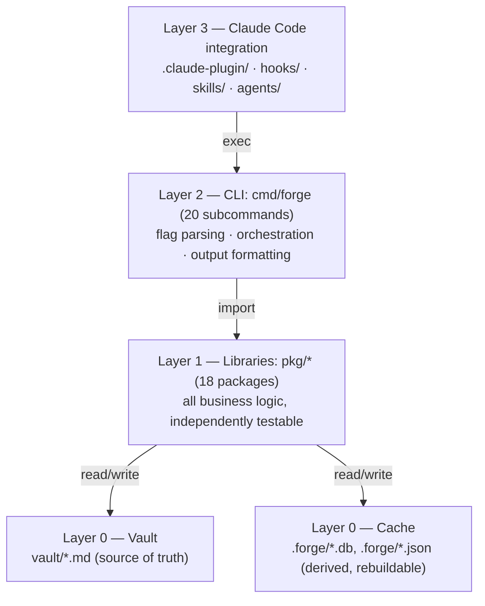

# Knowledge Forge

**Turn "explain X" moments into a verified, linked Obsidian vault — zero model calls required.**

<p>
  <a href="LICENSE"></a>
  <a href="https://github.com/mimir45/Knowledge-Forge/stargazers"></a>
  <a href="#still-in-beta"></a>
</p>

<p>
  <a href="#install">Install</a> ·
  <a href="#how-to-use-it">Usage</a> ·
  <a href="#architecture">Architecture</a> ·
  <a href="#privacy">Privacy</a> ·
  <a href="#documentation">Documentation</a> ·
  <a href="#license">License</a>
</p>

---

Turns "explain X" moments into permanent, linked, verified markdown notes in an
Obsidian vault — so the second time the question comes up, it's a vault read instead of
a research run.

The defensible core is a Go static-analysis engine (dedup recall, schema validation,
drift detection, report generation) that runs with **zero model calls**. An optional
four-tier LLM layer (`none` / `host` / `api` / `advisor`-critique) sits on top,
configurable per pipeline stage — the static core works standalone with no API key and
no network call.

## Install

As a Claude Code plugin:

```
claude plugin marketplace add mimir45/Knowledge-Forge
```

This pulls in the `forge` skills, agents, and hook bindings (`hooks/hooks.json`) —
Claude Code discovers all of them from this repo's default component paths, no manual
`settings.json` edits needed.

**Requirements:** `git` on `PATH` (`pkg/gitsig` shells out to the `git` CLI for churn,
ownership, and co-change coupling analysis). Nothing else for the portable build; see
"Build lanes" below for what the optional code-index feature adds.

Then run the setup wizard once, before Knowledge Forge is usable — it writes your
config and developer profile and nothing else:

```
forge init --vault ~/Documents/Base --language java \
           --frameworks spring-boot,hibernate --seniority senior
```

Swap the flags for your own stack (`--vault` is the only required one). See the
[usage guide](docs/USAGE.md#2-forge-init--the-setup-wizard) for the full flag
reference.

## How to use it

Once the plugin is installed, Knowledge Forge mostly works in the background: as you
work with Claude Code, it recalls existing notes before letting a question turn into a
fresh research run, and captures new explanations into your vault as they happen. The
`forge` CLI is there for everything else, manual or scheduled:

- `forge recall` — deterministic, lexical scoring of a new question against every
  existing note, before any research runs.
- `forge drift` — git-anchored: checks note code citations against a code repo's
  history on `post-commit` / `post-merge` / `post-checkout`, never against the
  uncommitted working tree.
- `forge check` — the weekly pass: renders every static report into `<vault>/reports/`.
- `forge gate` — the seven quality gates; a failing draft goes to `_inbox/` with
  `confidence: low`, never a silent publish.
- `forge logback` — makes the vault's knowledge discoverable from the code repo itself:
  `docs/knowledge-map.md`, per-module `CLAUDE.md` fragments, opt-in inline markers.
- `forge scrub` — redacts secret/PII-shaped content from a vault copy; fails closed —
  see `pkg/scrub`.

Run `forge --help`, or any subcommand with `--help`, for the full command reference. For
a full walkthrough of installation, configuration, and every command in detail, see the
[usage guide](docs/USAGE.md).

## Architecture

Knowledge Forge is built static-first: the core that actually recalls notes, checks
drift, and gates quality runs with zero model calls, so the system works with no API key
and no network dependency at all. The vault's markdown is the single source of truth —
the SQLite cache and every generated report are derived, disposable artifacts that
`forge reindex` can always rebuild from the vault, never the other way around. Claude
Code sits on top as the orchestration layer, invoking the `forge` CLI, which in turn
calls into the `pkg/*` libraries that hold all the actual logic — a strict,
one-directional dependency chain, top to bottom. That separation is why the static core
is independently testable and trustworthy: no LLM step is load-bearing for correctness,
only for optional enrichment.



For the full layer-by-layer breakdown, package map, and import graph, see the
[architecture doc](docs/ARCHITECTURE.md).

## Build lanes

Two lanes, because `pkg/codeindex` (go-tree-sitter, Java + TypeScript) is the one
package in this repo that needs cgo:

- `make build` (or `CGO_ENABLED=0 go build ./...`) — the portable lane. Cross-compiles
  to all six release targets from any host, no C toolchain required. **This is what
  ships in releases.** A portable binary has no code index: `forge check` reports
  `moc/codebase.md` as skipped rather than claiming an unparsed codebase is fully
  documented, and `forge drift` skips symbol-only citations instead of calling them
  resolved.
- `make full` (or `CGO_ENABLED=1 go build ./cmd/forge`) — this host's binary with the
  tree-sitter code index compiled in. Needs a C toolchain for the build host.

`make test` runs both: the full suite under `CGO_ENABLED=1` (so the tree-sitter parser
tests actually run), then `CGO_ENABLED=0 go build ./...` to confirm the portable
invariant still holds.

## Privacy

**Nothing leaves your machine.** There is no upload path in this codebase — no
telemetry endpoint, no sync, no phone-home. Every subcommand reads and writes local
files, and the only network access anywhere is `pkg/linkcheck`'s HTTP HEAD against URLs
your own notes cite, plus the optional LLM tiers you configure yourself.

Two things are recorded as you work, both under `<vault>/.forge/` and both switchable
off in config:

- **The ask log** (`telemetry.enabled`) stores a topic label and a sha256 hash of each
  question — never the question text, your code, or file contents.
- **The capture tiers** (`dataset.enabled`, `dataset.capture`) accumulate training pairs
  as a byproduct of normal use. Same rule: hashes and topic slugs, never raw questions.

Exporting that data is a manual command, never scheduled, and anonymized by default —
it fails closed rather than emitting anything it could not redact. The full account,
including the one thing redaction deliberately does not hide, is in
[`docs/datasets.md`](docs/datasets.md).

## Documentation

This is the current, complete set of docs — nothing else is missing, older design
documents were retired as the project moved from an internal build log to a public
plugin:

- [`docs/ARCHITECTURE.md`](docs/ARCHITECTURE.md) — architecture, package map, import
  graph.
- [`docs/USAGE.md`](docs/USAGE.md) — full usage guide: install, configuration, every
  command.
- [`docs/datasets.md`](docs/datasets.md) — training-data capture tiers and privacy
  detail.
- [`CLAUDE.md`](CLAUDE.md) — project layout, invariants, and commands, for anyone
  (human or AI agent) working in this repo.

## License

MIT — see [`LICENSE`](LICENSE).

---

## Still in beta

Knowledge Forge is still early. Things will change, edges are still rough, and I'm
actively working through them. If you hit a bug, have an idea for a feature, or just
think something could work better — please open an issue. Bug reports, feature ideas,
and blunt feedback are all genuinely welcome and useful right now.

If it's useful to you, a star, a repost, or a note about how it went for you would mean
a lot — I read all of it. Thanks for trying it out. 🙏
